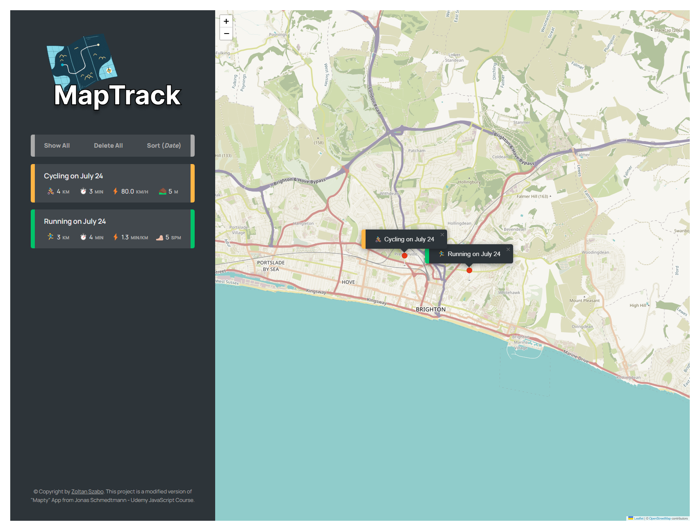

<h1>MapTrack</h1>

<h1>Overview</h1>

The Exercise Tracker App is a user-friendly mobile application designed to record and manage running and cycling activities for fitness enthusiasts. Suitable for casual and professional athletes alike.

<h2>Key Features</h2>
    <ol>
        <li><strong>Activity Recording:</strong>
            <ul>
                <li><strong>Real-Time GPS Tracking:</strong> Log routes and distances with real-time feedback.</li>
                <li><strong>Manual Entry:</strong> Input exercise data manually.</li>
            </ul>
        </li>
        <li><strong>Performance Metrics:</strong>
            <ul>
                <li><strong>Statistics:</strong> Track distance, duration, speed, pace, and elevation.</li>
                <li><strong>Historical Data:</strong> Analyse past workouts to monitor progress.</li>
            </ul>
        </li>
        <li><strong>Interactive Maps:</strong>
            <ul>
                <li><strong>Route Visualization:</strong> View paths on detailed maps.</li>
                <li><strong>Route Sharing:</strong> Share routes with friends.</li>
            </ul>
        </li>
    </ol>
    

